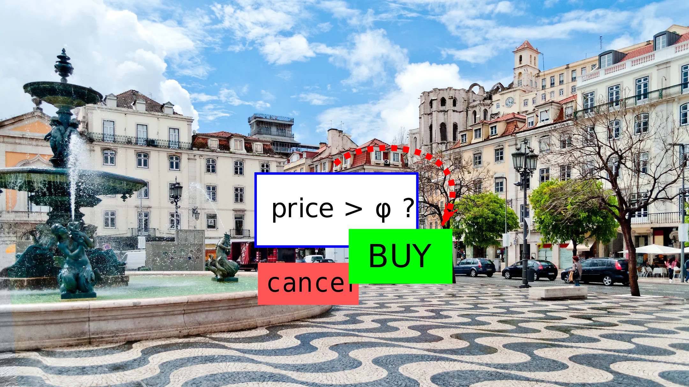

# Conditional Orders

A gnosis safe module that lets you create custom standing orders to be executed by keepers when arbitrary conditions are met

This was built for the [ETH Lisbon](https://www.ethlisbon.org/) 2022 hackathon.

[Presentation](https://euler-xyz.github.io/ethlisbon-hackathon/presentation/index.html#/)

## Architecture

Gnosis safe users can install a custom module that allows the safe owner installation custom scripts of arbitrary complexity. Keeper bots then monitor for these orders and when they detect any that can be executed succesfully, they will do so in exchange for a fee that is determined by the script.

When a script is installed, an event is emitted that contains the code for the script. The keepers must transmit this code when performing execution. This version will be hashed by the gnosis safe module to verify the scripts haven't been modified.

## Components

* `contracts/contracts/WeirollModule.sol` - Gnosis safe plug-in
* `contracts/contracts/Libraries/` - Order building blocks
* `frontend/` - Browser UI for order construction
* `contracts/tasks/keeper.ts` - Basic keeper implementation

## Use-Cases

These scripts allow users to create conditional orders of many types:

* Limit orders
  * Standing buy/sell order that will execute when a certain price level is reached
* Stop loss
  * Limit order to close out a losing position to prevent further losses
* Take profit
  * Limit order to close out a winning position to realise profits
* Trailing stop
  * A stop loss order where the the stop loss price level increases as the order becomes more profitable
* One-cancels-all
  * A group of orders where the execution of one will cancel the others. For example, limit order that wants to buy a total amount of an asset that has multiple equivalents. For example, buy 1 ETH worth of WETH/stETH/rETH, in any combination.
* If-touched orders
  * Orders that activate when a certain condition is met. For example, a limit order becomes valid only once a price of an unrelated asset reaches a certain level.
* Good after/before time
  * Time limits that constrain when an order is valid
* Leverage management
  * Maintain an account's health-score as prices change
